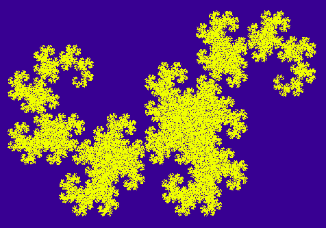

# [Dragon curve](https://ulearn.me/course/basicprogramming/Praktika_Dragon_curve__f9dd2a00-cc48-42d7-914a-813e3f9847e0)

[Скачайте проект DragonFractal](https://api.ulearn.me/slides/BasicProgramming/f9dd2a00-cc48-42d7-914a-813e3f9847e0/exercise/student-zip/Fractals.zip)

В этой задаче вам нужно будет нарисовать вот такую фигуру:

Вряд ли это пригодится вам в будущем, но зато красиво! :)
Подробнее про этот фрактал можете почитать, например, [в википедии](http://en.wikipedia.org/wiki/Dragon_curve).
Алгоритм построения фрактала читайте в комментариях в классе DragonFractalTask
Кстати, похожим образом можно построить ещё множество фракталов, в частности, [фрактальный папоротник](https://en.wikipedia.org/wiki/Barnsley_fern).

[Решение](DragonFractalTask.cs)