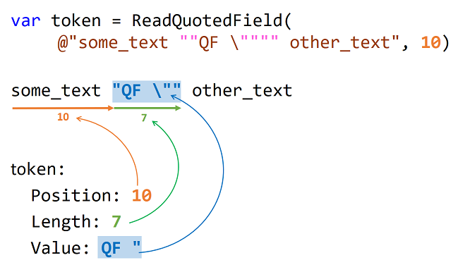

# [Поля в кавычках](https://ulearn.me/course/basicprogramming/Praktika_Polya_v_kavychkakh__7a098f71-f436-436f-92ed-287d7b1bca3c)

[Скачайте проект TableParser](https://api.ulearn.me/slides/BasicProgramming/7a098f71-f436-436f-92ed-287d7b1bca3c/exercise/student-zip/TableParser.zip)

В этой серии задач вам нужно реализовать парсер полей.
Парсером обычно называют алгоритм, который из текста делает набор объектов, представленных в этом тексте.

Итак, на вход нашего парсера подается строка текста.
В результате выполнения серии этих задач у вас получится алгоритм, возвращающий список полей,
извлечённых из текста по описанным ниже правилам,
либо пустой список, если полей в исходном тексте не оказалось.

Проверить работу парсера можно запустив программу.
Появится окно, в котором можно вводить разные входные строки и смотреть, на какие поля эти строки разбиваются.

### Типы полей

Поля могут быть двух типов: простые и поля в кавычках.
Для простоты понимания начало и конец поля будем выделять квадратным скобками `[]`.

#### Простые поля

Простые поля не могут быть пустыми, не могут содержать пробелов и разделяются одним или несколькими пробелами.
Пример: в строке `a` - одно простое поле `[a]`, в строке `ab cd` - два простых поля разделенных пробелом `[ab]` и `[cd]`.

#### Поля в кавычках

У таких полей начало и конец ограничивается кавычками.
Кавычки могут быть двух типов: двойными `"` и одинарными `'`.

Кавычки разных типов могут быть вложенными.

То есть строка `"a 'b' 'c' d" '"1" "2" "3"'` содержит два поля `[a 'b' 'c' d]` и `["1" "2" "3"]`.
Вложенные кавычки считаются элементами поля.

Могут содержать пробелы и быть пустыми. То есть строка `'' "bcd ef" 'x y'` содержит три поля пустое поле `[]`, `[bcd ef]` и `[x y]`.

Поля, заключенные в кавычки, могут не отделяться от других полей пробелами.
То есть строка `a"b c d e"f` содержит 3 поля `[a]`,`[b c d e]` и `[f]`.

Кавычки в конце строки можно не закрывать.
Если в строке отсутствует последняя парная закрывающая кавычка, считать, что соответствующее поле заканчивается в конце строки.
То есть строка `abc "def g h` содержит два поля `[abc]` и `[def g h]`.

Поле внутри кавычек может содержать символы кавычек, экранированные символом `\`
(другими словами пара символов `\"` интерпретируется как символ кавычки, являющийся частью поля).

Символ `\` также может быть экранирован самим же собой. То есть строка `"a \"c\""` содержит одно поле `[a "c"]`, а строка `"\\" b` — два поля `[\]` и `[b]`.

В простых полях символ `\` не считается экранирующим символом, поэтому строка `\\` — это одно поле из двух слэшей `[\\]`, а `\"a b\"` — это два поля `[\]` и `[a b"]`

Игнорируйте пробелы в начале или в конце строки, если они не входят в поле.

Гарантируется, что в полях в кавычках не используется символ `\` в единственном экземпляре.
То есть за ним обязательно следует, какой-то экранируемый символ.
Например: `\\`, `\"`, `\'` и т.д. Не может быть `"a\ b"` или `"a \"`.

## Концепция токена

При решении задач разбора текста, например, вычленении из строки фрагментов, приходится отслеживать 2 вещи:

1. Проинтерпретированное значение, соответствующее фрагменту. Например, значение фрагмента `"a\"b"` это три символа: `a`, символ кавычки и `b`, хотя сам фрагмент имеет длину 6 символов.
2. Позицию фрагмента в строке.

Для этого удобно завести свой тип и хранить там эту информацию.
Этот тип уже создан для вас — найдите и изучите в проекте класс `Token`.
Фрагменты, выделяемые из текста часто называют токенами или лексемами. Мы дальше будем называть их токенами.

Иллюстрация поясняющая семантику свойств класса Token при анализе текста:

* Position — номер символа в строке, с которого начинается запись токена.
* Length — количество символов, которое занимает токен в строке (открывающие и закрывающие кавычки включительно).
* Value — это проинтерпретированное значение токена. То есть «очищенное» от ненужных кавычек и слэшей.

---

## Задача

В этой задаче реализуйте один вспомогательный метод ReadQuotedField, для чтения полей в кавычках.
В следующей задаче вам нужно будет воспользоваться этим методом.

Метод ReadQuotedField принимает строку и позицию в строке.
Гарантируется, что на стартовом индексе находится открывающая кавычка поля в кавычках.
Метод должен обработать символы до следующей кавычки, если она есть (если нету, то до конца строки), и вернуть токен поля в кавычках.
См. пример на схеме выше.

Проверить корректность работы можно запустив программу на выполнение.
Но кроме ручного тестирования вам необходимо создать автоматические тесты в классе QuotedFieldTests в том же файле.
Удобно создавать тесты, добавляя новые атрибуты TestCase (см. туториал по запуску тестов).

На проверку нужно отправлять файл, в котором есть и решение задачи и тесты.

[Решение](QuotedFieldTask.cs)

---

# [Тестирование](https://ulearn.me/course/basicprogramming/Praktika_Testirovanie__b0d7bc0f-7309-4ff9-b472-2c19a57f25a4)

В этой задаче вам не нужно реализовывать алгоритм.

Вместо этого напишите набор тестов, который покрывает все основные ситуации для задачи, описанной в прошлом слайде.
Обратите внимание, что вам нужны тесты на всё задание, а не только на поле в кавычках.
Каждый тест должен быть новым атрибутом у метода `RunTests`.
То есть, просто дописать ещё раз строку `[TestCase(..., ...)]`, где первым аргументом указать входные данные, а вторым ожидаемый вывод.

Не пишите сложных тестов, которые проверяют сразу много различных свойств алгоритма.

Если такой тест падает, то сложно понять, в чем на самом деле была ошибка.

[Решение](TestingPracticeTests.cs)

---

# [Парсер полей](https://ulearn.me/course/basicprogramming/Praktika_Parser_poley__e5beecc5-2b45-4271-acdc-3ae0af775485)

Наконец, вы готовы к тому, чтобы реализовать всю задачу, поставленную два слайда назад!

В классе `FieldsParserTask` реализуйте метод `ParseLine`, для которого вы создавали тесты в предыдущей задаче.
Создайте модульные тесты на это решение и перенесите разработанные в прошлой задаче тестовые случаи в модульные тесты.

Решение получится более простым, если ваши вспомогательные методы будут использовать `Token` в качестве возвращаемого значения.
В качестве вспомогательных методов могут быть методы, читающие разные виды полей (у вас уже реализован метод `ReadQuotedField`),
а также метод пропускающий пробелы между полями.

Обратите внимание на метод `GetIndexNextToToken` в классе `Token`. Он возвращает позицию, с которой нужно продолжить анализ строки.

[Решение](FieldsParserTask.cs)